# ARCHITECTURE.md — iby_closet System Architecture & Product Design

> **Last updated:** 2026-02-21
> **Project:** iby_closet — editorial men's fashion e-commerce
> **Owner:** Ibrahim Hamed (Lagos, Nigeria)

---

## Table of Contents

1. [System Architecture](#1-system-architecture)
2. [Sitemap & Page Relationships](#2-sitemap--page-relationships)
3. [User Flows](#3-user-flows)
4. [Page-by-Page Functionality](#4-page-by-page-functionality)
5. [API Routes](#5-api-routes)
6. [Database Schema (ER Diagram)](#6-database-schema-er-diagram)
7. [Data Flow](#7-data-flow)
8. [Sales Channels](#8-sales-channels)
9. [Third-Party Integrations](#9-third-party-integrations)
10. [File Structure Map](#10-file-structure-map)

---

## 1. System Architecture

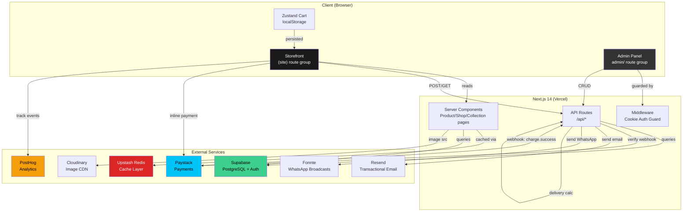

---

## 2. Sitemap & Page Relationships

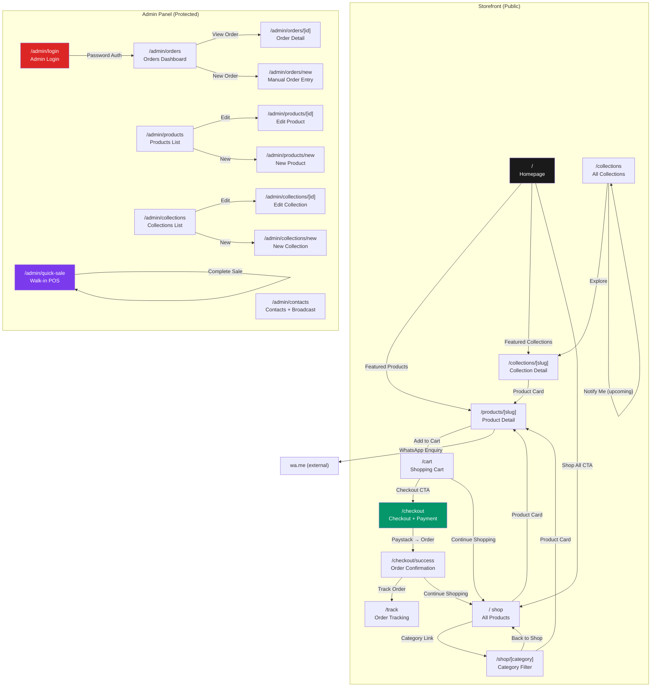

---

## 3. User Flows

### 3.1 — Shopping & Checkout Flow

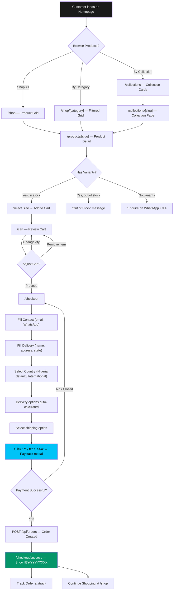

### 3.2 — Order Tracking Flow

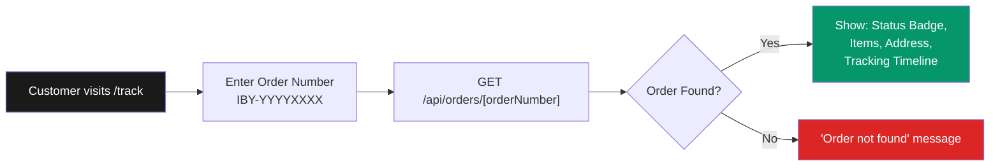

### 3.3 — Admin: Manual Order Entry (Instagram/WhatsApp/Walk-in)

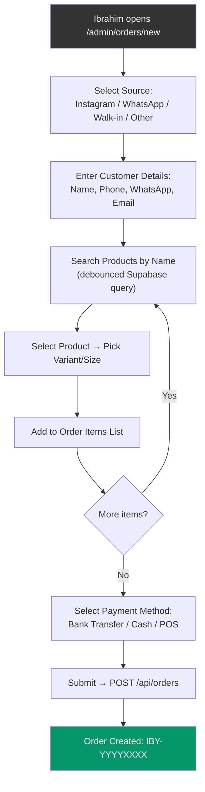

### 3.4 — Admin: Quick Sale (Walk-in POS)

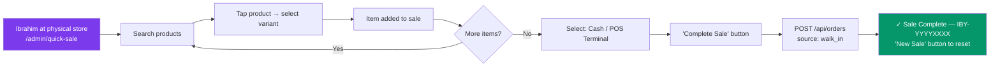

### 3.5 — Payment Confirmation Flow

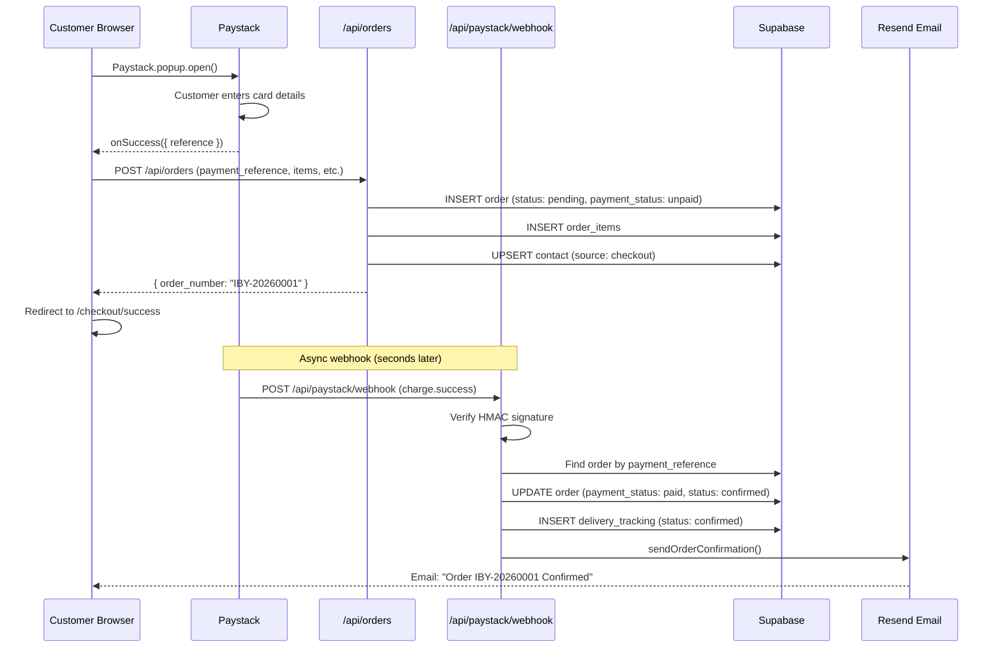

### 3.6 — Contact Capture Flow

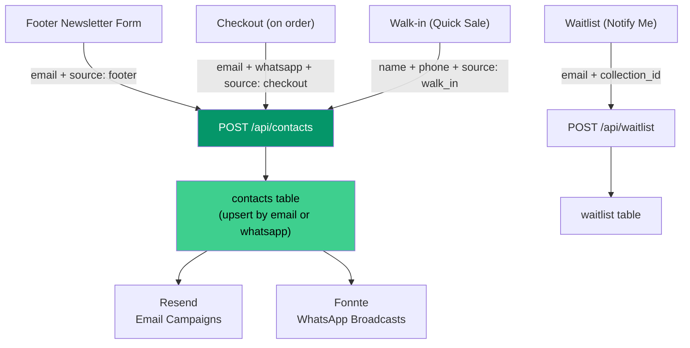

---

## 4. Page-by-Page Functionality

### Storefront Pages

| Page | URL | Type | Key Functionality |
|---|---|---|---|
| **Homepage** | `/` | Server | Full-screen black hero, featured products grid (4-col), featured collections section. Data from Supabase, cached via Redis (5-min TTL). |
| **Shop** | `/shop` | Server | All active products in 4-col grid (2-col mobile). Product cards: image (aspect-4/5), name, price. Cached via Redis. |
| **Category** | `/shop/[category-slug]` | Server | Same as shop but filtered by `category_id`. Category header, "Back to Shop" link. `notFound()` if invalid slug. |
| **Collections** | `/collections` | Server | All active + upcoming collections. Card grid with cover image, description (2-line clamp), status badge. "Notify Me" form for upcoming (client component). |
| **Collection Detail** | `/collections/[slug]` | Server | Hero section (cover image or black fallback), collection story, products in that collection. "Collection arriving soon" if no products yet. |
| **Product Detail** | `/products/[slug]` | Server + Client | Image gallery (primary + thumbnails), name, price, collection tag, description. Client `ProductPurchasePanel`: size selector, add-to-cart, out-of-stock, WhatsApp enquiry. Fabric/care accordions. |
| **Cart** | `/cart` | Client | Items list with image, name, size, qty controls (+/-), remove. Order summary sidebar with subtotal. "Proceed to Checkout" CTA. Empty state → link to `/shop`. |
| **Checkout** | `/checkout` | Client | Contact (email, WhatsApp), Delivery (name, address, city, state/country), Shipping options (radio, auto-fetched), Paystack payment button (dynamic import, SSR-safe). Order summary sidebar. |
| **Order Success** | `/checkout/success` | Client | "Order Confirmed" + large order number. Links to track order and continue shopping. Clears cart on mount. |
| **Order Tracking** | `/track` | Client | Order number input → `GET /api/orders/[orderNumber]`. Shows status badge, items, address, vertical tracking timeline from `delivery_tracking`. |

### Admin Pages

| Page | URL | Auth | Key Functionality |
|---|---|---|---|
| **Login** | `/admin/login` | None | Password form → `POST /api/admin/auth`. Sets `iby_admin_session` cookie. Redirects to `/admin/orders`. |
| **Dashboard** | `/admin` → `/admin/orders` | Cookie | Redirects to orders. |
| **Orders** | `/admin/orders` | Cookie | Orders table with source + status filters. Links to detail/new. |
| **Order Detail** | `/admin/orders/[id]` | Cookie | Full order view, update status dropdown, add tracking notes. Timeline of `delivery_tracking` events. |
| **New Order** | `/admin/orders/new` | Cookie | Manual entry: source, customer info, product search (debounced), variant picker, payment method. For Instagram/WhatsApp/Walk-in orders. |
| **Products** | `/admin/products` | Cookie | Product list with status. Edit/Delete actions. |
| **Edit Product** | `/admin/products/[id]` | Cookie | Form: name, slug, price, description, fabric, care, category, collection, images, status. |
| **New Product** | `/admin/products/new` | Cookie | Same form, creates new product. |
| **Collections** | `/admin/collections` | Cookie | Collection list with status/release date. |
| **Edit Collection** | `/admin/collections/[id]` | Cookie | Form: name, slug, description, cover image, status, release date, featured. |
| **New Collection** | `/admin/collections/new` | Cookie | Same form, creates new collection. |
| **Contacts** | `/admin/contacts` | Cookie | Contact table with source filter. CSV export. WhatsApp broadcast via Fonnte API. |
| **Quick Sale** | `/admin/quick-sale` | Cookie | Mobile-friendly POS. Product search → variant select → add to sale. Cash/POS payment. Instant order creation. |

---

## 5. API Routes

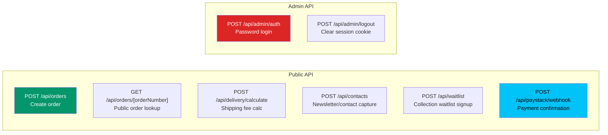

| Route | Method | Auth | Input | Output | Notes |
|---|---|---|---|---|---|
| `/api/orders` | POST | None | `{customer_name, email, phone, whatsapp, delivery_address, items[], delivery_fee, payment_method, payment_reference}` | `{order_number, order_id}` | Generates IBY-YYYYXXXX, inserts order + items, upserts contact |
| `/api/orders/[orderNumber]` | GET | None | URL param | `{order, items[], tracking[]}` | Public tracking — omits email/phone |
| `/api/delivery/calculate` | POST | None | `{state, city, subtotal, country?}` | `{options: [{courier, service, fee, estimated_days}]}` | Lagos/non-Lagos/international pricing |
| `/api/contacts` | POST | None | `{email?, whatsapp_number?, first_name?, last_name?, source}` | `{success, id}` | Upserts by email or whatsapp |
| `/api/waitlist` | POST | None | `{email?, whatsapp_number?, collection_id?, product_id?}` | `{success}` | No upsert — allows duplicates |
| `/api/paystack/webhook` | POST | HMAC | Paystack event payload | `{received: true}` | Verifies signature, updates order to paid/confirmed, sends email |
| `/api/admin/auth` | POST | None | `{password}` | Sets cookie | Cookie: `iby_admin_session`, httpOnly, 7-day expiry |
| `/api/admin/logout` | POST | Cookie | — | Clears cookie | `maxAge: 0`, `path: /admin` |

---

## 6. Database Schema (ER Diagram)

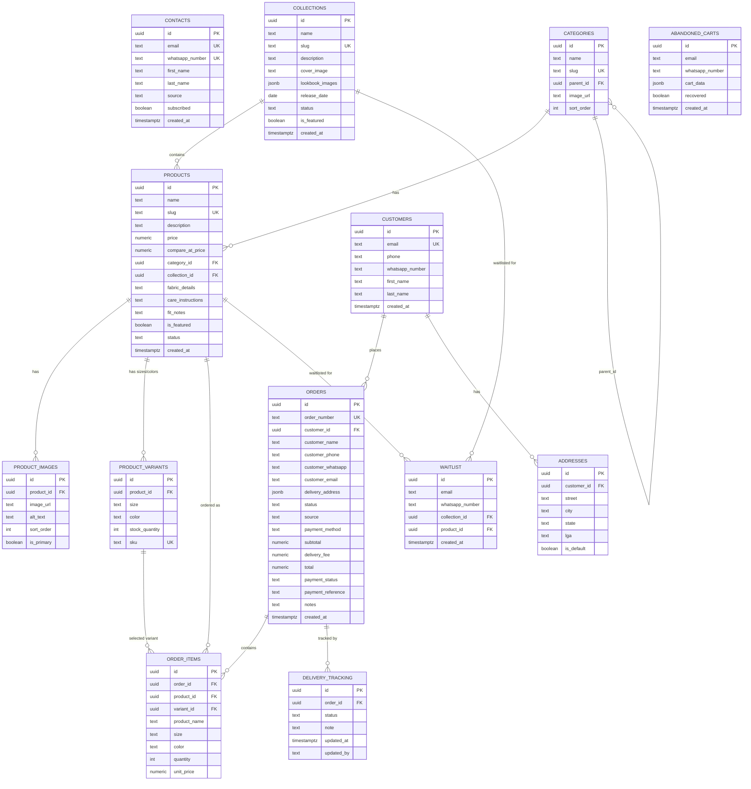

---

## 7. Data Flow

### Caching Layer

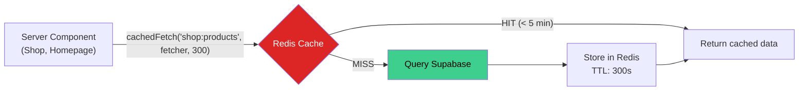

### State Management

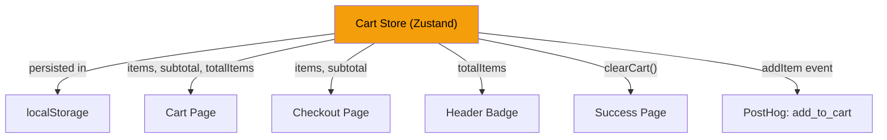

---

## 8. Sales Channels

All orders converge to same `orders` table with unified `IBY-YYYYXXXX` format:

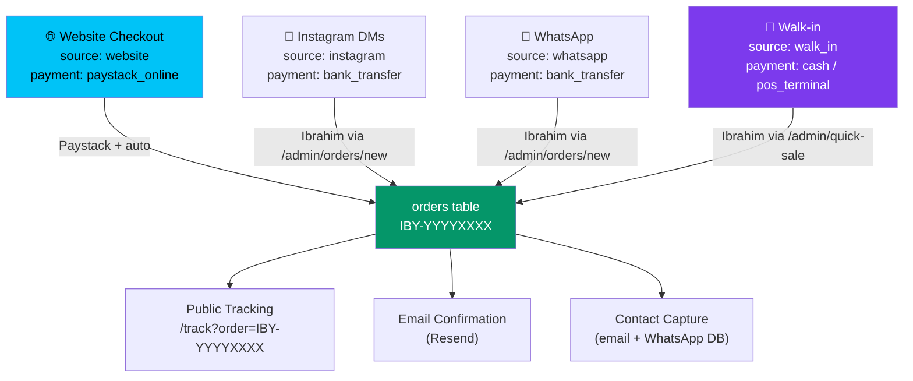

---

## 9. Third-Party Integrations

| Service | Purpose | Env Vars | Integration Point |
|---|---|---|---|
| **Supabase** | PostgreSQL database, storage | `NEXT_PUBLIC_SUPABASE_URL`, `NEXT_PUBLIC_SUPABASE_ANON_KEY`, `SUPABASE_SERVICE_ROLE_KEY` | `src/lib/supabase.ts` — two clients (browser + server) |
| **Paystack** | Payment processing | `NEXT_PUBLIC_PAYSTACK_PUBLIC_KEY`, `PAYSTACK_SECRET_KEY` | Inline popup via `react-paystack`, webhook at `/api/paystack/webhook` |
| **Resend** | Transactional email | `RESEND_API_KEY` | `src/lib/email.ts` — order confirmation HTML emails |
| **Fonnte** | WhatsApp broadcasts | `NEXT_PUBLIC_FONNTE_TOKEN` | Admin contacts page — bulk messaging via Fonnte REST API |
| **Cloudinary** | Image hosting/CDN | `NEXT_PUBLIC_CLOUDINARY_CLOUD_NAME`, `CLOUDINARY_API_KEY`, `CLOUDINARY_API_SECRET` | Product/collection images served via Cloudinary URLs |
| **PostHog** | Analytics & events | `NEXT_PUBLIC_POSTHOG_KEY`, `NEXT_PUBLIC_POSTHOG_HOST` | `PostHogProvider` + `PostHogPageView` in site layout. Tracks `$pageview` + `add_to_cart`. |
| **Upstash Redis** | Server-side caching | `UPSTASH_REDIS_REST_URL`, `UPSTASH_REDIS_REST_TOKEN` | `src/lib/redis.ts` + `src/lib/cache.ts` — `cachedFetch()` with TTL |
| **Vercel** | Hosting & deployment | — | Next.js App Router, edge middleware, serverless API routes |

---

## 10. File Structure Map

```
iby_closet/
├── CLAUDE.md                          # Project brief (Claude owns)
├── GEMINI.md                          # Gemini agent workspace
├── CODEX.md                           # Codex agent workspace
├── ARCHITECTURE.md                    # This file
├── task.md                            # Shared task board
├── .env.local                         # Environment variables (gitignored)
├── .env.example                       # Template for env vars
├── next.config.mjs                    # Next.js config (image domains, etc.)
├── tailwind.config.ts                 # Tailwind configuration
├── tsconfig.json                      # TypeScript config
├── vitest.config.ts                   # Test runner config (Batch 4)
│
├── public/images/instagram/           # Product images (seeded from Instagram)
│
├── scripts/
│   ├── seed_collection_and_variants.js   # Seeds Rhythm & Thread collection
│   ├── fix_product_data.js               # Product data repair script
│   └── cleanup_products.js               # Product cleanup script
│
├── supabase/migrations/
│   └── 20240221000000_initial_schema.sql # Full DB schema
│
├── __tests__/                         # Test files (Batch 4)
│   ├── setup.ts                       # Supabase mock setup
│   ├── api/                           # API route tests
│   └── components/                    # Component + store tests
│
└── src/
    ├── middleware.ts                   # Admin auth guard (cookie check)
    │
    ├── lib/
    │   ├── supabase.ts                # Supabase clients (browser + server)
    │   ├── types.ts                   # TypeScript DB interfaces
    │   ├── cart-store.ts              # Zustand cart with localStorage persist
    │   ├── redis.ts                   # Upstash Redis singleton
    │   ├── cache.ts                   # cachedFetch() helper
    │   └── email.ts                   # Resend order confirmation
    │
    ├── components/
    │   ├── Header.tsx                 # Sticky nav + cart badge (client)
    │   ├── Footer.tsx                 # Links + newsletter form (client)
    │   ├── PostHogProvider.tsx         # PostHog init wrapper (client)
    │   └── PostHogPageView.tsx         # Route-based pageview tracking (client)
    │
    └── app/
        ├── layout.tsx                 # Root layout (fonts, globals.css)
        ├── globals.css                # Tailwind + custom styles
        │
        ├── (site)/                    # ← Route group (no URL effect)
        │   ├── layout.tsx             # Header + Footer + PostHog
        │   ├── page.tsx               # Homepage (server, cached)
        │   ├── shop/
        │   │   ├── page.tsx           # Shop All (server, cached)
        │   │   └── [category-slug]/page.tsx  # Category filter (server)
        │   ├── collections/
        │   │   ├── page.tsx           # Collections index (server)
        │   │   ├── [slug]/page.tsx    # Collection detail (server)
        │   │   └── _components/NotifyMeButton.tsx  # Waitlist form (client)
        │   ├── products/
        │   │   └── [slug]/
        │   │       ├── page.tsx       # Product detail (server)
        │   │       └── ProductPurchasePanel.tsx  # Size/cart/WhatsApp (client)
        │   ├── cart/page.tsx          # Shopping cart (client)
        │   ├── checkout/
        │   │   ├── page.tsx           # Checkout form + payment (client)
        │   │   ├── PaystackButton.tsx # Paystack popup trigger (client)
        │   │   └── success/page.tsx   # Order confirmed (client)
        │   └── track/page.tsx         # Public order tracking (client)
        │
        ├── admin/                     # ← Separate layout, cookie-guarded
        │   ├── layout.tsx             # Admin shell + sidebar
        │   ├── page.tsx               # Redirect → /admin/orders
        │   ├── login/page.tsx         # Password login form
        │   ├── _components/
        │   │   ├── AdminSidebar.tsx   # Nav (desktop sidebar + mobile bottom)
        │   │   └── CollectionForm.tsx # Reusable collection form
        │   ├── orders/
        │   │   ├── page.tsx           # Orders dashboard
        │   │   ├── [id]/page.tsx      # Order detail + status update
        │   │   └── new/page.tsx       # Manual order entry
        │   ├── products/
        │   │   ├── page.tsx           # Products list
        │   │   ├── [id]/page.tsx      # Edit product
        │   │   ├── new/page.tsx       # New product
        │   │   └── _components/ProductForm.tsx  # Reusable product form
        │   ├── collections/
        │   │   ├── page.tsx           # Collections list
        │   │   ├── [id]/page.tsx      # Edit collection
        │   │   └── new/page.tsx       # New collection
        │   ├── contacts/page.tsx      # Contacts + WhatsApp broadcast
        │   └── quick-sale/page.tsx    # Walk-in POS
        │
        └── api/
            ├── admin/
            │   ├── auth/route.ts      # POST — password login
            │   └── logout/route.ts    # POST — clear session
            ├── contacts/route.ts      # POST — upsert contact
            ├── delivery/
            │   └── calculate/route.ts # POST — shipping fee calc
            ├── orders/
            │   ├── route.ts           # POST — create order
            │   └── [orderNumber]/route.ts  # GET — public lookup
            ├── paystack/
            │   └── webhook/route.ts   # POST — payment webhook
            └── waitlist/route.ts      # POST — waitlist signup
```

---

## Design Principles

1. **Editorial-first** — Not a generic product catalogue. Every collection has a story, campaign shoots, lookbook energy. Inspired by garmisland.com but more brand-world-driven.
2. **Nigeria-optimized** — Default to Nigerian states, Naira pricing, Lagos delivery tiers. International is additive, not primary.
3. **Mobile-first** — All pages designed for 375px+ first. Admin panel optimized for Ibrahim's phone usage at the physical store.
4. **Progressive data** — Server components for SEO-critical pages (shop, collections, products). Client components only for interactivity (cart, checkout, admin).
5. **Resilient** — Redis cache fails silently to Supabase. Paystack webhook validates HMAC. Email errors don't break orders. Mock Redis for missing env vars.
6. **Unified orders** — All 4 sales channels (website, Instagram, WhatsApp, walk-in) produce identical `IBY-YYYYXXXX` orders. Same tracking, same admin view.
